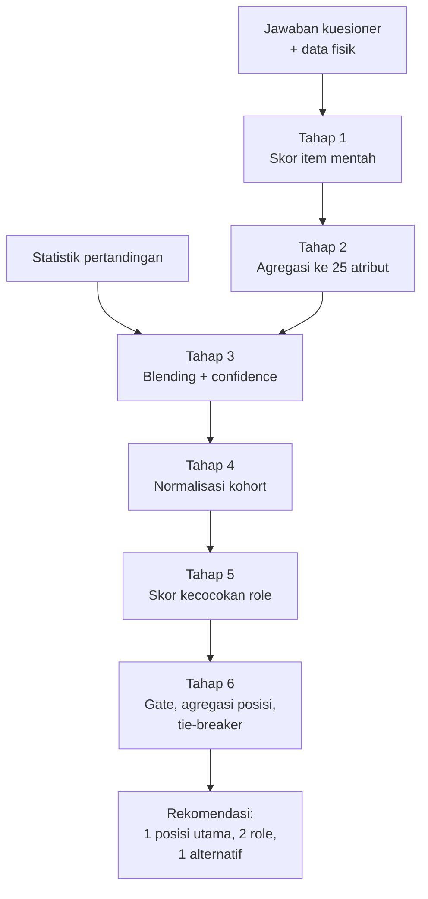
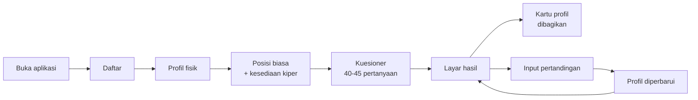
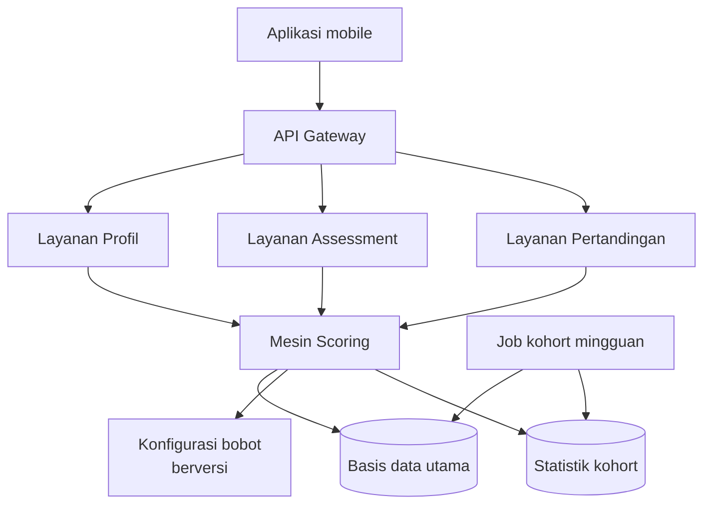
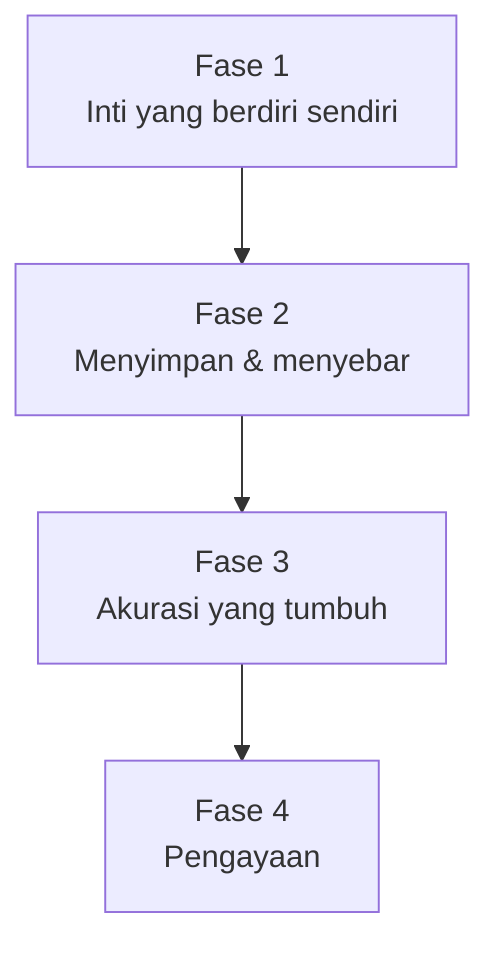

# PRD — Aplikasi Position & Role Finder Minisoccer

**Disusun oleh:** Amirul · **Tanggal:** 17 September 2026 · **Status:** Draft v0.2 (sinkron dengan feature map)

## Ringkasan Eksekutif

Aplikasi ini menjawab satu pertanyaan yang selalu muncul di lapangan tarkam: "gue cocoknya main di mana?" Pemain amatir memilih posisi berdasarkan kebiasaan, senioritas, atau siapa yang datang duluan — bukan berdasarkan gaya bermainnya. Produk ini mengubah jawaban itu menjadi rekomendasi berbasis data: pemain mengisi kuesioner gaya bermain, sistem menghitung 25 atribut, lalu mencocokkannya ke 7 posisi dan 16 role minisoccer 7v7 dengan skor kecocokan 0-100.

Nilai utamanya bukan sekadar label posisi, tapi **role** — cara bermain di posisi itu. Dua bek tengah bisa punya role berbeda: satu Stopper yang agresif duel, satu Ball-Playing Defender yang membangun serangan dari belakang. Pemain amatir jarang tahu perbedaan ini, dan itulah yang membuat mereka merasa "kurang cocok" padahal posisinya sudah benar.

Akurasi rekomendasi meningkat seiring waktu. Kuesioner memberi profil awal (cold start), lalu statistik pertandingan yang diinput pemain setelah main menggeser profil ke arah performa nyata. Sistem menyimpan confidence score agar pemain tahu seberapa dapat dipercaya rekomendasinya.

Target MVP: pemain baru bisa menyelesaikan assessment dalam ≤ 6 menit, menerima rekomendasi 1 posisi utama + 2 role + 1 posisi alternatif, dan memahami alasannya lewat penjelasan berbasis atribut. Sukses diukur dari 60% pemain yang menyatakan rekomendasi "sesuai atau membuka wawasan", dan 35% yang kembali menginput minimal 3 pertandingan dalam 30 hari.

## Latar Belakang & Problem Statement

Minisoccer tumbuh cepat sebagai olahraga rekreasi perkotaan di Indonesia, dimainkan 7v7 di lapangan sintetis berukuran sekitar 60x40 meter. Formatnya menuntut hal yang berbeda dari sepak bola 11v11: ruang lebih sempit, transisi lebih cepat, setiap pemain terlibat menyerang dan bertahan, dan stamina jadi pembatas utama karena pergantian pemain sering terbatas.

Masalahnya, sebagian besar pemain amatir memetakan dirinya memakai kerangka 11v11 yang mereka tonton di TV. Seorang pemain yang "biasanya winger" di 11v11 sering tidak sadar bahwa di 7v7 peran itu berubah jadi wingback dua arah yang menuntut stamina jauh lebih tinggi. Akibatnya muncul tiga gejala yang berulang:

1. **Salah posisi struktural.** Pemain dengan kekuatan duel dan antisipasi bagus ditaruh di depan karena badannya besar, padahal profilnya bek tengah.
2. **Posisi benar, role salah.** Pemain ditaruh sebagai gelandang tengah tapi diminta menyerang terus, padahal profilnya holding midfielder yang kuat di positioning bertahan dan lemah di dribel.
3. **Tidak ada bahasa bersama.** Tim tarkam tidak punya kosakata untuk membicarakan peran, sehingga instruksi berhenti di "jaga orangnya" dan "maju aja".

Dampaknya terasa pada pengalaman bermain: pemain merasa tidak berkontribusi, cepat lelah di posisi yang salah, dan sebagian berhenti main. Ini bukan masalah performa elit — ini masalah kepuasan dan keberlanjutan hobi.

**Problem statement.** Pemain minisoccer amatir tidak punya cara objektif dan murah untuk mengetahui posisi dan role yang paling sesuai dengan gaya bermainnya, karena satu-satunya alternatif yang ada saat ini adalah penilaian subjektif teman atau analisis video yang mahal dan tidak praktis.

**Kenapa sekarang.** Biaya akuisisi data turun drastis — pemain sudah terbiasa mengisi form dan mencatat statistik pertandingan di grup WhatsApp. Yang belum ada adalah lapisan yang menerjemahkan data mentah itu menjadi rekomendasi yang bisa dipakai.

## Tujuan Produk & Metrik Sukses

Tujuan produk adalah membuat setiap pemain minisoccer amatir tahu posisi dan role terbaiknya dalam satu sesi singkat, lalu membuat rekomendasi itu makin akurat setiap kali mereka bermain.

**North Star Metric:** jumlah pemain yang memiliki *profil terverifikasi* — yaitu pemain yang sudah menyelesaikan assessment dan menginput minimal 3 pertandingan, sehingga confidence score profilnya ≥ 0,6.

| Kategori | Metrik | Target MVP (90 hari) |
| --- | --- | --- |
| Aktivasi | Penyelesaian assessment dari yang memulai | ≥ 70% |
| Aktivasi | Median waktu penyelesaian assessment | ≤ 6 menit |
| Kualitas | Pemain menilai rekomendasi "sesuai" atau "membuka wawasan" | ≥ 60% |
| Kualitas | Kesesuaian rekomendasi dengan posisi yang benar-benar dimainkan | ≥ 55% top-1, ≥ 80% top-3 |
| Retensi | Pemain input ≥ 3 pertandingan dalam 30 hari | ≥ 35% |
| Retensi | Pemain kembali mengulang assessment dalam 90 hari | ≥ 25% |
| Pertumbuhan | Pemain yang membagikan kartu profilnya | ≥ 30% |

**Non-goals untuk MVP.** Produk ini tidak menyusun line-up tim, tidak melakukan analisis video, tidak memakai perangkat wearable atau GPS, tidak menilai bakat untuk tujuan rekrutmen profesional, dan tidak memberi program latihan terstruktur. Semua itu kandidat untuk V2 dan seterusnya, tapi menambahkannya di MVP akan mengaburkan proposisi inti.

## Persona & User Stories

**Persona utama — Rizky, 27, "pemain tarkam rutin".** Main 1-2 kali seminggu di lapangan sewaan bersama teman kantor. Pernah main bola sejak SMA tapi tidak pernah dilatih formal. Selalu ditaruh di posisi yang sama karena kebiasaan, dan diam-diam merasa lebih cocok di tempat lain. Ponsel Android kelas menengah, koneksi kadang lemah di lapangan indoor. Jobs-to-be-done: *"Ketika saya merasa kurang berkontribusi di lapangan, saya ingin tahu posisi mana yang memaksimalkan kelebihan saya, supaya saya lebih menikmati permainan dan dihargai tim."*

**Persona sekunder — Bayu, 22, "pemain baru".** Baru mulai ikut minisoccer setahun terakhir, belum punya posisi tetap, sering ditaruh di mana saja. Jobs-to-be-done: *"Ketika saya bergabung ke tim baru, saya ingin bisa mengatakan saya main di posisi apa, supaya tidak terlihat tidak punya identitas."*

**Anti-persona.** Pelatih profesional dan scout klub bukan target MVP. Kebutuhan mereka — perbandingan lintas pemain, tracking beban latihan, validasi statistik — menuntut ketelitian data yang tidak realistis dari self-assessment.

### User Stories per Epic

**Epic 1 — Onboarding & Profil Dasar**

- Sebagai pemain baru, saya ingin membuat profil dengan data fisik dasar (tinggi, berat, kaki dominan, usia) agar rekomendasi mempertimbangkan keterbatasan fisik saya.
- Sebagai pemain, saya ingin menyebutkan posisi yang biasa saya mainkan agar sistem bisa membandingkan kebiasaan dengan hasil analisis.

**Epic 2 — Assessment Gaya Bermain**

- Sebagai pemain, saya ingin mengisi kuesioner yang pertanyaannya terasa seperti situasi nyata di lapangan, bukan istilah teknis yang tidak saya pahami.
- Sebagai pemain, saya ingin bisa berhenti di tengah dan melanjutkan nanti tanpa kehilangan jawaban.
- Sebagai pemain, saya ingin tahu sudah sampai mana progres saya agar tidak menyerah di tengah jalan.

**Epic 3 — Hasil & Penjelasan**

- Sebagai pemain, saya ingin melihat posisi utama saya beserta skor kecocokan agar tahu seberapa kuat rekomendasinya.
- Sebagai pemain, saya ingin melihat dua role di posisi itu dan perbedaannya dalam bahasa sehari-hari.
- Sebagai pemain, saya ingin melihat tiga atribut terkuat dan dua terlemah saya agar tahu alasan di balik rekomendasi.
- Sebagai pemain, saya ingin melihat satu posisi alternatif agar punya opsi ketika tim sudah penuh di posisi utama.

**Epic 4 — Input Pertandingan**

- Sebagai pemain, saya ingin mencatat statistik pertandingan dalam kurang dari 60 detik setelah main agar tidak terasa membebani.
- Sebagai pemain, saya ingin melihat bagaimana profil saya bergeser setelah beberapa pertandingan agar merasa sistemnya hidup.

**Epic 5 — Berbagi**

- Sebagai pemain, saya ingin membagikan kartu profil ke grup WhatsApp tim agar teman-teman tahu posisi saya dan ikut mencoba.

## Ruang Lingkup

**Masuk MVP.** Registrasi dan profil dasar; kuesioner adaptif 40-45 pertanyaan; mesin scoring 25 atribut; taksonomi 7 posisi dan 16 role untuk format 7v7; halaman hasil dengan penjelasan atribut; input statistik pertandingan manual; blending kuesioner dan statistik dengan confidence score; kartu profil yang bisa dibagikan sebagai gambar; riwayat perubahan profil; bahasa Indonesia.

**Di luar MVP.** Format 5v5 dan 8v8 (masuk V1); peer rating antar-pemain (V1); manajemen tim dan line-up (V2); rekomendasi latihan per atribut (V2); analisis video atau tracking GPS (belum direncanakan); leaderboard atau ranking kompetitif (ditolak — mendorong pengisian kuesioner yang tidak jujur); bahasa Inggris (V1).

**Asumsi yang perlu divalidasi.**

| # | Asumsi | Cara validasi | Risiko jika salah |
| --- | --- | --- | --- |
| A1 | Pemain amatir mampu menilai kemampuannya sendiri dengan cukup konsisten | Uji test-retest pada 30 pemain, jeda 2 minggu; target korelasi ≥ 0,7 | Seluruh basis scoring runtuh; perlu bergeser ke peer rating |
| A2 | Pemain mau menginput statistik setelah bermain | Prototipe input 60 detik pada 20 pemain selama 4 pekan | Blending tidak pernah aktif; produk berhenti di kuesioner satu kali |
| A3 | Bobot role yang disusun dari literatur taktik cocok dengan realita minisoccer amatir | Panel 5 pelatih minisoccer menilai 40 profil; bandingkan dengan output sistem | Rekomendasi terasa meleset; perlu kalibrasi ulang bobot |
| A4 | 7v7 adalah format dominan pengguna target | Survei 100 pemain tentang format yang paling sering dimainkan | Taksonomi posisi tidak relevan bagi sebagian besar pengguna |

## Taksonomi Posisi & Role Minisoccer

MVP memakai format 7v7 di lapangan sekitar 60x40 meter sebagai basis taksonomi, karena format ini paling umum di lapangan minisoccer komersial Indonesia. Tiga formasi rujukan yang mencakup hampir semua variasi lapangan: 1-2-3-1 (seimbang), 1-3-2-1 (bertahan solid), dan 1-2-1-2-1 (kontrol tengah).

### Tujuh Posisi

| Kode | Posisi | Zona utama | Beban bertahan / menyerang |
| --- | --- | --- | --- |
| GK | Kiper | Kotak penalti sendiri | 95 / 5 |
| CB | Bek Tengah | Sepertiga pertahanan, koridor tengah | 85 / 15 |
| FB | Bek Sayap | Sepertiga pertahanan sampai tengah, koridor sayap | 65 / 35 |
| DM | Gelandang Bertahan | Depan bek, koridor tengah | 60 / 40 |
| CM | Gelandang Tengah | Sepertiga tengah, koridor tengah | 45 / 55 |
| WM | Gelandang Sayap | Koridor sayap, tengah sampai sepertiga akhir | 40 / 60 |
| ST | Penyerang | Sepertiga akhir, koridor tengah | 20 / 80 |

Gelandang serang tidak dibuat sebagai posisi terpisah karena di 7v7 ruang antar-lini terlalu sempit; perannya diwakili oleh role Advanced Playmaker dan Shadow Striker.

### Enam Belas Role

Role adalah *cara* bermain di sebuah posisi. Setiap role punya definisi perilaku yang bisa dikenali pemain awam tanpa istilah teknis.

| Kode | Role | Posisi | Perilaku khas di lapangan |
| --- | --- | --- | --- |
| GK-SS | Shot Stopper | GK | Bertahan di garis, mengandalkan refleks dan penempatan, jarang keluar kotak |
| GK-SK | Sweeper Keeper | GK | Berani keluar jauh menyapu bola, ikut membangun serangan dengan kaki |
| CB-ST | Stopper | CB | Menjemput lawan lebih dulu, agresif duel badan dan udara, main sederhana |
| CB-BP | Ball-Playing Defender | CB | Tenang membawa bola keluar dari belakang, umpan menembus lini |
| CB-CV | Cover Defender | CB | Menjaga kedalaman, membaca umpan terobosan, mengandalkan kecepatan pulih |
| FB-DF | Defensive Fullback | FB | Jarang naik, fokus menutup sayap dan menahan winger lawan |
| FB-WB | Attacking Wingback | FB | Naik-turun sepanjang sayap, memberi lebar dan umpan silang |
| FB-IV | Inverted Fullback | FB | Masuk ke dalam saat menyerang, menambah pemain di tengah |
| DM-AN | Anchor | DM | Berdiri di depan bek, memutus serangan, memberi umpan pendek aman |
| DM-RG | Deep-Lying Playmaker | DM | Mengatur tempo dari dalam, umpan jauh mengubah arah serangan |
| CM-B2B | Box-to-Box | CM | Berlari dari kotak ke kotak, terlibat bertahan dan menyerang, stamina tinggi |
| CM-AP | Advanced Playmaker | CM | Beroperasi di antara lini lawan, mencari celah dan umpan kunci |
| WM-TW | Touchline Winger | WM | Menempel garis, melewati lawan satu lawan satu, umpan silang |
| WM-IW | Inverted Winger | WM | Memotong ke dalam dari sayap ke kaki kuat, menembak dari sudut sempit |
| ST-PO | Poacher | ST | Menunggu di kotak penalti, gerakan pendek, penyelesaian cepat satu-dua sentuhan |
| ST-TM | Target Man | ST | Menahan bola membelakangi gawang, memenangkan duel, menjadi titik tumpu |
| ST-PF | Pressing Forward | ST | Menekan bek lawan tanpa henti, memaksa kesalahan, gerakan tanpa bola intens |

Catatan: Shadow Striker dari Epic 3 diwakili oleh CM-AP yang bermain tinggi; jika riset pengguna menunjukkan pemain membedakan keduanya, role ke-17 ditambahkan di V1.

## Model Atribut Pemain

Sistem merepresentasikan gaya bermain sebagai vektor 25 atribut, masing-masing pada skala 0-100. Dua puluh atribut berlaku untuk pemain lapangan; lima atribut khusus kiper hanya dihitung jika pemain menyatakan bersedia bermain sebagai kiper.

Atribut dikelompokkan ke lima pilar. Pengelompokan ini dipakai untuk visualisasi radar di halaman hasil dan untuk mendeteksi jawaban kuesioner yang tidak konsisten.

| Kode | Atribut | Pilar | Yang diukur |
| --- | --- | --- | --- |
| PAC | Kecepatan Puncak | Fisik | Kecepatan lari jarak 20-30 meter dibanding lawan sebaya |
| ACC | Akselerasi | Fisik | Ledakan 5 meter pertama, penting di ruang sempit |
| STA | Stamina | Fisik | Kemampuan menjaga intensitas sampai menit akhir |
| STR | Kekuatan Badan | Fisik | Menang duel badan, menahan dorongan lawan |
| AGI | Kelincahan | Fisik | Ubah arah cepat, keseimbangan saat berbalik |
| JMP | Jangkauan Udara | Fisik | Kombinasi tinggi badan dan lompatan saat duel bola atas |
| FTC | Kontrol Pertama | Teknik | Kualitas sentuhan pertama saat menerima bola di bawah tekanan |
| DRB | Dribel | Teknik | Melewati lawan satu lawan satu, membawa bola di ruang sempit |
| PSS | Umpan Pendek | Teknik | Akurasi dan kecepatan umpan jarak dekat |
| LPS | Umpan Jauh & Terobosan | Teknik | Umpan menembus lini atau memindahkan permainan |
| FIN | Penyelesaian Akhir | Teknik | Konversi peluang di dalam kotak |
| LSH | Tendangan Jarak Jauh | Teknik | Ancaman dari luar kotak |
| CRS | Umpan Silang | Teknik | Kualitas umpan dari sayap ke kotak |
| WFT | Kaki Lemah | Teknik | Seberapa layak kaki non-dominan dipakai |
| OPS | Positioning Menyerang | Taktik | Gerakan tanpa bola mencari ruang kosong |
| DPS | Positioning Bertahan | Taktik | Menempati posisi yang benar saat tim kehilangan bola |
| VIS | Visi & Keputusan | Taktik | Melihat opsi terbaik dan memilihnya cepat |
| PRS | Intensitas Pressing | Taktik | Kemauan dan ketepatan menekan pemegang bola lawan |
| WRK | Work Rate Dua Arah | Taktik | Kesediaan turun bertahan setelah menyerang, dan sebaliknya |
| TKL | Tekel & Intersep | Duel | Merebut bola bersih, membaca jalur umpan |
| AER | Duel Udara | Duel | Memenangkan bola atas secara aktual, bukan sekadar tinggi |
| ANT | Antisipasi | Duel | Membaca permainan sebelum kejadian |
| CMP | Ketenangan | Mental | Kualitas keputusan saat tertekan atau tertinggal skor |
| AGG | Agresivitas | Mental | Keberanian masuk duel, dengan risiko pelanggaran |
| LDR | Komunikasi | Mental | Mengatur rekan, berbicara di lapangan |

**Atribut khusus kiper** (dihitung terpisah, tidak masuk vektor pemain lapangan):

| Kode | Atribut | Yang diukur |
| --- | --- | --- |
| GK-REF | Refleks | Penyelamatan jarak dekat dan reaksi cepat |
| GK-POS | Penempatan Posisi | Mempersempit sudut tembak |
| GK-DIS | Distribusi | Kualitas lemparan dan umpan kaki memulai serangan |
| GK-SWP | Berani Keluar | Kesediaan menyapu bola di luar kotak |
| GK-CMD | Menguasai Kotak | Memerintah pertahanan dan memotong umpan silang |

Skala 0-100 dibaca sebagai posisi relatif terhadap populasi pemain amatir, bukan terhadap pemain profesional. Nilai 50 berarti rata-rata pemain minisoccer amatir; 80 berarti masuk 10% teratas di komunitas amatir.

## Sumber Data

Profil atribut dibangun dari tiga sumber dengan tingkat kepercayaan berbeda. MVP memakai dua yang pertama; peer rating disiapkan strukturnya tapi diaktifkan di V1.

| Sumber | Cara masuk | Atribut yang dijangkau | Bobot kepercayaan dasar |
| --- | --- | --- | --- |
| Kuesioner self-assessment | 40-45 pertanyaan situasional, skala 1-5 dan pilihan skenario | Semua 25 atribut | 1,0 (baseline) |
| Data fisik objektif | Input tinggi, berat, usia, kaki dominan saat onboarding | JMP, STR, AER sebagian | 1,4 |
| Statistik pertandingan | Input manual ≤ 60 detik setelah main | 11 atribut (lihat tabel berikut) | 1,8 per pertandingan, jenuh di 10 |
| Peer rating (V1) | Rekan setim menilai 5 atribut per pertandingan | 5 atribut terpilih | 2,2 |

**Statistik pertandingan yang diinput.** Daftar dijaga sependek mungkin agar input tetap di bawah 60 detik. Semua field opsional kecuali menit bermain dan posisi yang dimainkan.

| Field | Tipe | Atribut yang dipengaruhi |
| --- | --- | --- |
| Menit bermain | Angka | STA |
| Posisi yang dimainkan | Pilihan | Konteks normalisasi, bukan atribut |
| Gol | Angka | FIN, OPS |
| Assist | Angka | VIS, LPS, CRS |
| Peluang yang diciptakan | Angka | VIS, OPS |
| Tekel berhasil | Angka | TKL, ANT |
| Intersep | Angka | ANT, DPS |
| Duel udara menang | Angka | AER, JMP |
| Kehilangan bola | Angka | FTC, CMP |
| Pelanggaran | Angka | AGG (dua arah) |
| Clean sheet (kiper) | Boolean | GK-REF, GK-POS |
| Penilaian diri pasca-laga | Skala 1-5 | Faktor kalibrasi global |

**Penanganan bias self-assessment.** Kuesioner memakai tiga mekanisme untuk menahan bias melambungkan diri: pertanyaan berpasangan yang memaksa trade-off ("lebih sering Anda yang mengejar bola, atau Anda yang menunggu di posisi?"), pertanyaan berbasis frekuensi kejadian nyata alih-alih penilaian abstrak ("dalam satu pertandingan, berapa kali Anda melewati lawan dengan dribel?"), dan tiga pasang pertanyaan pengecekan konsistensi yang menghitung skor keandalan responden.

## Spesifikasi Algoritma Scoring

Pipeline berjalan dalam enam tahap, dari jawaban mentah sampai daftar role terurut.



### Tahap 1 — Skor Item Mentah

Setiap pertanyaan kuesioner menghasilkan nilai item pada skala 0-100. Tiga tipe pertanyaan dikonversi berbeda:

Pertanyaan Likert 1-5 dikonversi linear dengan `v = (jawaban - 1) x 25`. Pertanyaan frekuensi dikonversi memakai fungsi saturasi `v = 100 x (n / (n + k))` di mana `n` adalah frekuensi yang dilaporkan dan `k` konstanta kejenuhan per pertanyaan (default 3), sehingga jawaban ekstrem tidak mendominasi. Pertanyaan trade-off dua pilihan memberi nilai 100 ke atribut yang dipilih dan 0 ke pasangannya, lalu diperhalus menjadi 75/25 jika responden memilih opsi "tergantung situasi".

Item bertanda terbalik (misalnya "saya sering telat kembali bertahan") dibalik dengan `v = 100 - v`.

### Tahap 2 — Agregasi ke Atribut

Setiap atribut `i` dihitung sebagai rata-rata tertimbang dari item yang memetakan ke atribut itu:

```
Q_i = ( Σ_j  ω_ij · v_j ) / ( Σ_j ω_ij )
```

Dengan `ω_ij` bobot kontribusi item `j` ke atribut `i` (0,5 untuk kontribusi sekunder, 1,0 untuk kontribusi utama). Setiap atribut dijangkau minimal dua item agar satu jawaban ekstrem tidak menentukan nilai.

Dua atribut mendapat penyesuaian dari data fisik objektif. Jangkauan udara dihitung `JMP = 0,6 x Q_JMP + 0,4 x P(tinggi)` di mana `P(tinggi)` adalah persentil tinggi badan pemain dalam kohort. Kekuatan badan mendapat penyesuaian serupa dari indeks massa tubuh, dibatasi ±12 poin agar tidak menghukum pemain bertubuh kecil secara berlebihan.

### Tahap 3 — Blending Kuesioner dan Statistik

Dijelaskan lengkap di bagian berikutnya. Hasilnya adalah nilai atribut gabungan `A_i` dan confidence `C ∈ [0,1]`.

### Tahap 4 — Normalisasi Kohort

Nilai atribut dinormalisasi terhadap populasi pengguna agar skor 0-100 bermakna secara relatif:

```
Ã_i = 50 + 10 · ( A_i - μ_i ) / σ_i        lalu dipotong ke rentang [1, 99]
```

Kohort dipilih berlapis: pemain dengan rentang usia dan format bermain yang sama jika tersedia ≥ 200 sampel, jika tidak turun ke seluruh populasi, dan jika masih kurang dari 200 sampel sistem memakai `μ` dan `σ` bawaan hasil kalibrasi awal dari panel pelatih. Parameter kohort dihitung ulang mingguan, bukan real-time, agar skor pemain tidak berubah tanpa sebab yang mereka lakukan.

### Tahap 5 — Skor Kecocokan Role

Setiap role `r` punya vektor bobot `w_r` pada 25 atribut dengan nilai 0 sampai 5. Skor dasar adalah rata-rata tertimbang:

```
Base_r = ( Σ_i  w_ri · Ã_i ) / ( Σ_i w_ri )
```

Bobot lengkap ada di Lampiran B. Contoh untuk tiga role yang kontras:

| Atribut | CB-ST Stopper | CM-B2B Box-to-Box | ST-PO Poacher |
| --- | --- | --- | --- |
| PAC Kecepatan | 2 | 3 | 3 |
| STA Stamina | 3 | 5 | 2 |
| STR Kekuatan | 5 | 3 | 3 |
| JMP Jangkauan Udara | 4 | 2 | 2 |
| FTC Kontrol Pertama | 2 | 4 | 4 |
| DRB Dribel | 1 | 3 | 2 |
| PSS Umpan Pendek | 3 | 4 | 2 |
| FIN Penyelesaian | 0 | 3 | 5 |
| OPS Positioning Menyerang | 0 | 3 | 5 |
| DPS Positioning Bertahan | 5 | 4 | 1 |
| VIS Visi & Keputusan | 2 | 4 | 3 |
| PRS Pressing | 4 | 4 | 4 |
| WRK Work Rate | 3 | 5 | 2 |
| TKL Tekel & Intersep | 5 | 4 | 1 |
| AER Duel Udara | 5 | 3 | 3 |
| ANT Antisipasi | 4 | 3 | 3 |
| CMP Ketenangan | 4 | 3 | 4 |
| AGG Agresivitas | 4 | 3 | 2 |

### Tahap 6 — Gate, Penalti, dan Skor Akhir

Rata-rata tertimbang saja tidak cukup, karena beberapa role punya syarat mutlak. Poacher dengan penyelesaian akhir di angka 30 tidak layak direkomendasikan meskipun atribut lainnya bagus. Karena itu setiap role punya satu sampai tiga atribut prasyarat dengan ambang `τ`:

```
Gate_r = Π_{j ∈ prasyarat(r)}  min( 1 , Ã_j / τ_rj ) ^ γ
```

Dengan `γ = 0,7`. Gate bernilai 1 ketika semua prasyarat terpenuhi, dan turun secara mulus (bukan nol mendadak) ketika ada yang kurang. Contoh prasyarat: ST-PO membutuhkan FIN ≥ 55 dan OPS ≥ 50; CB-ST membutuhkan TKL ≥ 55 dan STR ≥ 50; CM-B2B membutuhkan STA ≥ 60; WM-TW membutuhkan DRB ≥ 55 dan PAC ≥ 55.

Skor akhir role menggabungkan keduanya dan dipetakan ke skala 0-100:

```
Fit_r = Base_r · Gate_r
```

**Skor posisi** adalah skor role terbaik di posisi itu, dengan sedikit bonus jika pemain punya dua role kuat di posisi yang sama (menandakan fleksibilitas):

```
Pos_p = max_{r ∈ p} Fit_r  +  0,15 · ( second_{r ∈ p} Fit_r - 50 )⁺
```

**Tie-breaker** dipakai ketika dua posisi berselisih kurang dari 3 poin, berurutan: gate margin terbesar (pemain lebih aman di role itu); kesesuaian dengan posisi yang pernah dimainkan pemain; kelangkaan posisi di populasi (kiper dan bek tengah lebih langka, diberi prioritas ringan); dan terakhir preferensi eksplisit pemain saat onboarding.

**Ambang pelaporan.** Rekomendasi hanya ditampilkan sebagai "kuat" jika `Fit_r ≥ 65` dan `C ≥ 0,5`. Di bawah itu, hasil ditampilkan sebagai "indikasi awal" dengan ajakan menginput pertandingan untuk mempertajam.

## Contoh Perhitungan End-to-End

Contoh ini memakai pemain fiktif untuk menunjukkan setiap tahap menghasilkan angka yang bisa diperiksa. Angka kohort yang dipakai adalah nilai kalibrasi bawaan.

**Profil input.** Rizky, 27 tahun, tinggi 175 cm, berat 74 kg, kaki kanan, biasa main sebagai penyerang.

**Tahap 1-2 — Hasil agregasi atribut** (setelah konversi item dan penyesuaian fisik):

| Atribut | Nilai | Atribut | Nilai |
| --- | --- | --- | --- |
| PAC Kecepatan | 58 | OPS Positioning Menyerang | 47 |
| ACC Akselerasi | 55 | DPS Positioning Bertahan | 74 |
| STA Stamina | 78 | VIS Visi & Keputusan | 66 |
| STR Kekuatan | 71 | PRS Pressing | 76 |
| AGI Kelincahan | 52 | WRK Work Rate | 81 |
| JMP Jangkauan Udara | 63 | TKL Tekel & Intersep | 77 |
| FTC Kontrol Pertama | 64 | AER Duel Udara | 68 |
| DRB Dribel | 41 | ANT Antisipasi | 72 |
| PSS Umpan Pendek | 69 | CMP Ketenangan | 65 |
| FIN Penyelesaian | 38 | AGG Agresivitas | 70 |
| LPS Umpan Jauh | 58 | LDR Komunikasi | 62 |
| LSH Tendangan Jauh | 44 | CRS Umpan Silang | 43 |
| WFT Kaki Lemah | 39 |  |  |

Pembacaan cepat: work rate, tekel, dan stamina tinggi; penyelesaian akhir dan dribel rendah. Pemain ini memilih posisi penyerang, tapi profilnya tidak mendukung.

**Tahap 5 — Skor dasar tiga role kandidat.** Dihitung dengan bobot dari tabel di bagian sebelumnya.

Untuk ST-PO Poacher, jumlah bobot adalah 57 dan jumlah `w x Ã` adalah 3.079, sehingga `Base = 3.079 / 57 = 54,0`.

Untuk CM-B2B Box-to-Box, jumlah bobot 63 dan jumlah `w x Ã` sebesar 4.192, sehingga `Base = 4.192 / 63 = 66,5`.

Untuk CB-ST Stopper, jumlah bobot 57 dan jumlah `w x Ã` sebesar 3.933, sehingga `Base = 3.933 / 57 = 69,0`.

**Tahap 6 — Penerapan gate.**

| Role | Prasyarat | Nilai pemain | Rasio | Gate | Fit akhir |
| --- | --- | --- | --- | --- | --- |
| ST-PO Poacher | FIN ≥ 55; OPS ≥ 50 | 38; 47 | 0,69; 0,94 | 0,77 x 0,96 = 0,74 | 54,0 x 0,74 = **40,0** |
| CM-B2B Box-to-Box | STA ≥ 60 | 78 | 1,00 | 1,00 | 66,5 x 1,00 = **66,5** |
| CB-ST Stopper | TKL ≥ 55; STR ≥ 50 | 77; 71 | 1,00; 1,00 | 1,00 | 69,0 x 1,00 = **69,0** |

Gate menghukum Poacher dengan tajam, persis seperti yang diinginkan: pemain ini bisa berlari sepanjang hari tapi tidak bisa mencetak gol.

**Hasil akhir.** Posisi utama Bek Tengah (69,0) dengan role Stopper. Posisi alternatif Gelandang Tengah (66,5) dengan role Box-to-Box. Selisih 2,5 poin berada di bawah ambang tie-breaker 3 poin, sehingga aturan pemecah dipakai: gate margin sama-sama 1,00, pemain tidak pernah memainkan keduanya, dan bek tengah lebih langka di populasi — Bek Tengah menang.

**Penjelasan yang ditampilkan ke pemain.** "Gaya mainmu adalah perebut bola, bukan pencetak gol. Tekel (77), work rate (81), dan antisipasi (72) kamu jauh di atas rata-rata, sementara penyelesaian akhir (38) dan dribel (41) di bawah. Di minisoccer, kombinasi ini paling terpakai sebagai Bek Tengah bertipe Stopper — bek yang menjemput lawan lebih dulu, bukan menunggu. Kalau tim sudah penuh di belakang, Gelandang Tengah Box-to-Box adalah alternatif terdekatmu."

## Blending Kuesioner + Statistik

Kuesioner memberi profil lengkap tapi bias; statistik pertandingan memberi bukti nyata tapi hanya menjangkau sebagian atribut dan butuh waktu terkumpul. Blending menggabungkan keduanya dengan bobot yang bergeser seiring data bertambah.

**Rumus blending per atribut.** Untuk atribut `i` yang dijangkau statistik:

```
A_i = ( 1 - λ_i ) · Q_i  +  λ_i · S_i
λ_i = n_i / ( n_i + k )        dengan k = 5
```

`Q_i` adalah nilai dari kuesioner, `S_i` nilai dari statistik, dan `n_i` jumlah pertandingan yang memberi data untuk atribut itu. Konstanta `k = 5` berarti statistik baru menyamai bobot kuesioner setelah 5 pertandingan, dan mencapai 67% bobot setelah 10 pertandingan. Atribut yang tidak dijangkau statistik (misalnya VIS, CMP, LDR) tetap memakai `Q_i`.

| Jumlah pertandingan | λ (bobot statistik) | Interpretasi |
| --- | --- | --- |
| 0 | 0,00 | Murni kuesioner |
| 3 | 0,38 | Statistik mulai menggeser |
| 5 | 0,50 | Setara |
| 10 | 0,67 | Statistik dominan |
| 20 | 0,80 | Kuesioner jadi penyeimbang |

**Konversi statistik ke nilai atribut.** Statistik mentah dinormalisasi per 40 menit bermain, lalu dipetakan ke skala 0-100 melalui persentil kohort untuk posisi yang dimainkan. Contoh: tekel berhasil per 40 menit sebesar 4,2 yang berada di persentil 78 kohort bek menghasilkan `S_TKL = 78`. Normalisasi per posisi penting karena penyerang secara struktural jarang menekel, dan menghukum mereka untuk itu akan salah.

**Confidence score.** Setiap profil membawa satu angka kepercayaan yang ditampilkan ke pemain sebagai tiga tingkat (Awal, Cukup, Solid):

```
C = 0,35 · R  +  0,45 · ( N / (N + 6) )  +  0,20 · V
```

`R` adalah skor keandalan responden dari pertanyaan pengecekan konsistensi (0-1), `N` jumlah total pertandingan yang diinput, dan `V` adalah kelengkapan data (proporsi field statistik yang benar-benar diisi, 0-1). Ambang tampilan: `C < 0,4` Awal, `0,4 ≤ C < 0,7` Cukup, `C ≥ 0,7` Solid.

**Cold start.** Pemain tanpa satu pun pertandingan tetap menerima rekomendasi penuh, tapi halaman hasil menampilkan label "Awal" dan satu ajakan jelas untuk menginput pertandingan pertama. Sistem tidak pernah menolak memberi jawaban — menahan hasil sampai data cukup akan mematikan aktivasi.

**Kapan profil diperbarui.** Rekalkulasi dijalankan setiap kali pertandingan baru diinput, dan pemain diberi tahu hanya jika posisi utama atau role utama berubah. Perubahan skor kecil tidak memicu notifikasi agar tidak terasa berisik. Pemain juga bisa mengulang kuesioner kapan saja; jawaban baru menggantikan `Q_i` sepenuhnya, sementara `S_i` tetap terakumulasi.

**Peredam osilasi.** Untuk mencegah rekomendasi berubah-ubah setelah satu pertandingan buruk, posisi utama hanya berganti jika kandidat baru unggul ≥ 4 poin selama dua rekalkulasi berturut-turut.

## Functional Requirements

Prioritas memakai MoSCoW: M wajib ada di MVP, S penting tapi bisa menyusul, C nilai tambah, W ditunda.

| ID | Requirement | Prioritas | Kriteria penerimaan |
| --- | --- | --- | --- |
| FR-01 | Pemain mendaftar dengan nomor ponsel atau akun Google | M | Registrasi selesai ≤ 3 langkah; sesi bertahan 90 hari |
| FR-02 | Pemain mengisi profil fisik: tinggi, berat, usia, kaki dominan | M | Semua field wajib; validasi rentang wajar; bisa diubah kapan saja |
| FR-03 | Pemain menyatakan posisi yang biasa dimainkan dan kesediaan jadi kiper | M | Multi-pilih; jawaban "belum tahu" tersedia |
| FR-04 | Sistem menyajikan kuesioner 40-45 pertanyaan bertipe campuran | M | Satu pertanyaan per layar; indikator progres terlihat |
| FR-05 | Kuesioner melewati blok kiper jika pemain menolak jadi kiper | M | Blok 8 pertanyaan dilewati; total turun ke 37 |
| FR-06 | Jawaban tersimpan otomatis setiap pertanyaan | M | Tutup aplikasi lalu buka kembali memulihkan posisi terakhir |
| FR-07 | Pemain bisa kembali ke pertanyaan sebelumnya dan mengubah jawaban | M | Navigasi mundur tersedia di semua pertanyaan kecuali yang pertama |
| FR-08 | Sistem menghitung 25 atribut dan menyimpannya sebagai versi profil | M | Perhitungan ≤ 2 detik; setiap versi punya timestamp |
| FR-09 | Sistem menghitung skor kecocokan 16 role dan 7 posisi | M | Semua skor tersimpan, bukan hanya yang ditampilkan |
| FR-10 | Halaman hasil menampilkan posisi utama, 2 role, dan 1 posisi alternatif | M | Skor 0-100 ditampilkan; label confidence terlihat |
| FR-11 | Halaman hasil menjelaskan alasan lewat 3 atribut terkuat dan 2 terlemah | M | Penjelasan berbahasa awam, tanpa istilah teknis tanpa definisi |
| FR-12 | Halaman hasil menampilkan radar 5 pilar atribut | S | Terbaca di layar 360px; ada label numerik |
| FR-13 | Pemain bisa melihat semua 16 role beserta skornya | S | Daftar terurut menurun; role terkunci gate ditandai |
| FR-14 | Pemain menginput statistik pertandingan | M | Selesai ≤ 60 detik; semua field opsional kecuali menit dan posisi |
| FR-15 | Sistem merekalkulasi profil setiap statistik baru masuk | M | Rekalkulasi ≤ 3 detik; versi profil baru tercatat |
| FR-16 | Pemain diberi tahu hanya jika posisi atau role utama berubah | M | Notifikasi tidak muncul untuk perubahan skor saja |
| FR-17 | Pemain melihat riwayat perubahan profil sepanjang waktu | S | Minimal 10 versi terakhir; ditampilkan sebagai garis waktu |
| FR-18 | Pemain membagikan kartu profil sebagai gambar | M | Gambar 1080x1350; memuat nama, posisi, role, 3 atribut teratas |
| FR-19 | Pemain mengulang kuesioner kapan saja | S | Hasil lama tetap tersimpan; pemain bisa membandingkan |
| FR-20 | Pemain mengunduh atau menghapus seluruh datanya | M | Penghapusan tuntas ≤ 30 hari; unduhan format JSON |
| FR-21 | Admin melihat distribusi atribut kohort untuk kalibrasi | S | Dashboard internal; tidak ada data pribadi yang terekspos |
| FR-22 | Peer rating antar-pemain dalam satu tim | W | Ditunda ke V1 |
| FR-23 | Rekomendasi latihan per atribut lemah | W | Ditunda ke V2 |

## Alur Pengguna & Struktur Layar



**Layar 1 — Onboarding (3 langkah).** Satu tujuan per layar. Langkah pertama registrasi, kedua data fisik dengan slider besar agar mudah di ponsel, ketiga posisi biasa dengan ilustrasi lapangan yang bisa ditap. Layar ketiga juga bertanya kesediaan jadi kiper, karena jawabannya menentukan panjang kuesioner.

**Layar 2 — Kuesioner.** Satu pertanyaan per layar, teks maksimal dua baris, pilihan jawaban sebagai kartu besar yang bisa ditap dengan satu jempol. Progres ditampilkan sebagai bar tipis di atas, bukan angka "12 dari 45" yang terasa panjang. Pertanyaan dikelompokkan ke lima blok bertema (Fisik, Menyerang, Bertahan, Teknik, Mental) dengan layar transisi singkat antar-blok agar tidak terasa monoton.

**Layar 3 — Hasil.** Struktur dari atas ke bawah: nama posisi utama dalam tipografi besar; skor kecocokan dan label confidence; dua kartu role dengan deskripsi perilaku dalam bahasa sehari-hari; blok "Kenapa" berisi tiga atribut terkuat dan dua terlemah dengan nilai; radar lima pilar; posisi alternatif; tombol bagikan; dan ajakan menginput pertandingan pertama.

**Layar 4 — Input pertandingan.** Dirancang untuk diisi sambil berdiri di pinggir lapangan. Menit bermain dan posisi sebagai dua tap pertama, lalu grid angka besar untuk gol, assist, tekel, dan seterusnya dengan tombol plus-minus, bukan keyboard. Semua field setelah dua yang pertama bisa dilewati.

**Layar 5 — Riwayat profil.** Garis waktu vertikal yang menunjukkan setiap versi profil, posisi utama saat itu, dan apa yang berubah. Layar ini yang membuat produk terasa hidup dan memberi alasan untuk kembali.

**Prinsip copy.** Bahasa Indonesia sehari-hari, bukan bahasa buku. Istilah role ditulis dalam istilah aslinya (Poacher, Box-to-Box) karena pemain amatir sudah terpapar dari game sepak bola, tapi selalu diikuti satu kalimat penjelasan perilaku. Tidak ada angka yang ditampilkan tanpa konteks pembanding.

## Non-Functional Requirements

| Kategori | Requirement | Target terukur |
| --- | --- | --- |
| Performa | Waktu muat layar hasil | ≤ 1,5 detik pada jaringan 4G |
| Performa | Waktu hitung profil lengkap | ≤ 2 detik untuk 25 atribut dan 16 role |
| Performa | Ukuran unduhan awal aplikasi | ≤ 15 MB |
| Offline | Kuesioner dapat diisi tanpa koneksi | Jawaban tersimpan lokal, disinkronkan saat online |
| Offline | Input pertandingan tanpa koneksi | Antrean lokal, sinkron otomatis |
| Skalabilitas | Pengguna aktif bersamaan | 5.000 tanpa degradasi p95 |
| Skalabilitas | Rekalkulasi kohort mingguan | Selesai ≤ 20 menit untuk 500.000 profil |
| Privasi | Data pribadi | Nama dan nomor ponsel terenkripsi saat disimpan |
| Privasi | Hak penghapusan | Tuntas ≤ 30 hari sejak permintaan |
| Privasi | Data kohort | Hanya agregat, minimal 200 pemain per irisan |
| Keamanan | Autentikasi | OTP atau OAuth; tanpa kata sandi tersimpan |
| Aksesibilitas | Kontras teks | Minimal 4,5:1 untuk teks isi |
| Aksesibilitas | Target sentuh | Minimal 44x44 piksel |
| Aksesibilitas | Ukuran teks | Mengikuti pengaturan sistem sampai 200% tanpa terpotong |
| Kompatibilitas | Android | 8.0 ke atas |
| Kompatibilitas | iOS | 14 ke atas |
| Kompatibilitas | Layar | Berfungsi penuh pada lebar 360px |
| Bahasa | Antarmuka | Bahasa Indonesia; struktur siap untuk lokalisasi |
| Observabilitas | Pelacakan funnel | Setiap langkah onboarding dan kuesioner terinstrumentasi |
| Observabilitas | Audit skor | Setiap perhitungan menyimpan versi bobot yang dipakai |

## Arsitektur Teknis & Data Model

**Pendekatan.** Aplikasi mobile lintas platform dengan backend API tunggal. Mesin scoring dipisahkan sebagai modul tersendiri dengan bobot dan ambang disimpan sebagai konfigurasi berversi, bukan ditulis keras di kode, agar kalibrasi bisa dilakukan tanpa merilis ulang aplikasi.



**Tabel inti.**

| Tabel | Kolom penting | Catatan |
| --- | --- | --- |
| `players` | id, nama, telepon terenkripsi, tinggi, berat, lahir, kaki dominan, bersedia kiper | Satu baris per pemain |
| `assessments` | id, player\_id, versi kuesioner, selesai pada, skor keandalan | Riwayat pengisian, tidak ditimpa |
| `assessment_answers` | assessment\_id, item\_id, nilai mentah | Disimpan mentah agar bisa dihitung ulang saat bobot berubah |
| `matches` | id, player\_id, tanggal, menit, posisi dimainkan, field statistik | Semua statistik nullable |
| `attribute_profiles` | id, player\_id, dibuat pada, 25 nilai atribut, confidence, versi konfigurasi | Satu baris per rekalkulasi; inilah riwayat profil |
| `role_scores` | profile\_id, role\_code, base, gate, fit | 16 baris per profil |
| `scoring_configs` | versi, bobot role JSON, ambang gate, konstanta k dan gamma, aktif sejak | Sumber kebenaran algoritma |
| `cohort_stats` | irisan kohort, atribut, mean, stdev, n, dihitung pada | Diperbarui mingguan |

**Keputusan desain penting.** Jawaban kuesioner disimpan mentah, bukan hanya hasil agregasi, sehingga seluruh populasi bisa dihitung ulang ketika bobot dikalibrasi ulang. Tanpa ini, setiap perubahan bobot hanya berlaku untuk pengguna baru dan membuat perbandingan antar-pemain tidak valid.

**API utama.**

| Endpoint | Metode | Fungsi |
| --- | --- | --- |
| `/assessments` | POST | Memulai sesi assessment baru |
| `/assessments/{id}/answers` | PATCH | Menyimpan jawaban inkremental |
| `/assessments/{id}/submit` | POST | Menutup sesi dan memicu perhitungan |
| `/players/{id}/profile` | GET | Profil atribut terbaru beserta skor role |
| `/players/{id}/profile/history` | GET | Daftar versi profil |
| `/matches` | POST | Mencatat pertandingan dan memicu rekalkulasi |
| `/players/{id}/card` | GET | Gambar kartu profil untuk dibagikan |
| `/players/{id}/data` | GET, DELETE | Unduh atau hapus seluruh data |

## Roadmap Rilis

| Rilis | Durasi | Isi | Exit criteria |
| --- | --- | --- | --- |
| Fase 0 — Kalibrasi | 4 pekan | Menyusun bank pertanyaan, matriks bobot 16 role, uji test-retest 30 pemain, panel 5 pelatih menilai 40 profil | Korelasi test-retest ≥ 0,7; kesepakatan panel dengan output sistem ≥ 65% top-1 |
| MVP | 10 pekan | FR-01 sampai FR-11, FR-14 sampai FR-16, FR-18, FR-20; format 7v7; bahasa Indonesia | 500 pemain menyelesaikan assessment; penyelesaian ≥ 70%; kepuasan rekomendasi ≥ 60% |
| V1 | 8 pekan setelah MVP | Peer rating (FR-22), format 5v5 dan 8v8, radar dan daftar 16 role (FR-12, FR-13), riwayat profil (FR-17), bahasa Inggris | 2.000 pemain aktif; ≥ 35% menginput 3 pertandingan dalam 30 hari |
| V2 | 12 pekan setelah V1 | Manajemen tim dan saran line-up, rekomendasi latihan per atribut lemah (FR-23), perbandingan antar-pemain dalam satu tim | ≥ 200 tim terbentuk; retensi 30 hari ≥ 40% |

**Urutan pengerjaan dalam MVP.** Mesin scoring dan konfigurasi bobot dibangun lebih dulu karena seluruh produk bergantung padanya dan kalibrasinya memakan waktu terpanjang. Kuesioner dan layar hasil menyusul. Input pertandingan dikerjakan terakhir karena nilainya baru terasa setelah ada basis pengguna.

**Ketergantungan kritis.** Fase 0 harus tuntas sebelum MVP dimulai. Membangun antarmuka di atas bobot yang belum divalidasi berisiko membuang pekerjaan ketika kalibrasi mengubah struktur atribut.

## Risiko & Mitigasi

| Risiko | Dampak | Kemungkinan | Mitigasi |
| --- | --- | --- | --- |
| Bias self-assessment membuat semua pemain terlihat di atas rata-rata | Tinggi | Tinggi | Pertanyaan trade-off dan berbasis frekuensi; normalisasi kohort memaksa distribusi; skor keandalan responden menurunkan confidence |
| Pemain tidak pernah menginput pertandingan, blending tidak aktif | Tinggi | Sedang | Input dirancang ≤ 60 detik; pengingat pasca-laga; layar riwayat profil sebagai insentif kembali |
| Bobot role tidak cocok dengan realita minisoccer amatir | Tinggi | Sedang | Fase 0 dengan panel pelatih; bobot disimpan sebagai konfigurasi berversi sehingga bisa dikalibrasi tanpa rilis ulang |
| Rekomendasi bertentangan dengan posisi yang disukai pemain, memicu penolakan | Sedang | Tinggi | Selalu tampilkan posisi alternatif; jelaskan alasan lewat atribut; bahasa yang tidak menghakimi pilihan pemain |
| Kohort terlalu kecil di awal sehingga normalisasi tidak stabil | Sedang | Tinggi | Nilai bawaan dari panel pelatih dipakai sampai 200 sampel; skor kohort dihitung mingguan bukan real-time |
| Rekomendasi berubah-ubah setelah satu pertandingan buruk | Sedang | Sedang | Peredam osilasi: perubahan posisi utama butuh keunggulan ≥ 4 poin selama dua rekalkulasi |
| Pemain menyalahgunakan hasil untuk membanding-bandingkan dan merendahkan rekan | Sedang | Sedang | Tidak ada leaderboard; kartu profil hanya menampilkan kekuatan, bukan kelemahan; skor tidak dibandingkan lintas pemain di antarmuka |
| Data pribadi pemain bocor | Tinggi | Rendah | Enkripsi data identitas; autentikasi tanpa kata sandi; kohort hanya agregat dengan minimal 200 pemain |
| Kuesioner terasa panjang dan ditinggalkan di tengah | Sedang | Sedang | Simpan otomatis; blok bertema; lewati blok kiper; pantau titik keluar terbanyak lalu pangkas pertanyaan berdaya beda rendah |

## Lampiran A: Bank Pertanyaan Kuesioner

Kode tipe: **L** Likert 1-5, **F** frekuensi per pertandingan, **T** trade-off dua pilihan, **C** pengecekan konsistensi. Kolom bobot menunjukkan kontribusi ke atribut (1,0 utama; 0,5 sekunder).

### Blok 1 — Fisik (9 pertanyaan)

| # | Pertanyaan | Tipe | Atribut · bobot |
| --- | --- | --- | --- |
| Q01 | Saat adu lari 20 meter memperebutkan bola, seberapa sering Anda menang? | L | PAC 1,0 |
| Q02 | Dalam lima meter pertama dari berhenti, Anda lebih cepat dari kebanyakan lawan | L | ACC 1,0 · AGI 0,5 |
| Q03 | Di 10 menit terakhir pertandingan, intensitas lari Anda | L | STA 1,0 |
| Q04 | Berapa kali dalam satu pertandingan Anda merasa harus berjalan karena kehabisan napas? | F | STA 1,0 (terbalik) |
| Q05 | Saat berbenturan badan dengan lawan, Anda biasanya | T: bertahan tegak / terdorong | STR 1,0 |
| Q06 | Saat harus berbalik arah mendadak, Anda | L | AGI 1,0 |
| Q07 | Dalam duel bola atas, berapa kali per pertandingan Anda menang? | F | AER 1,0 · JMP 0,5 |
| Q08 | Anda merasa lompatan Anda tinggi dibanding pemain seukuran Anda | L | JMP 1,0 |
| Q09 | Setelah menyerang, seberapa cepat Anda kembali ke posisi bertahan? | L | WRK 1,0 · STA 0,5 |

### Blok 2 — Menyerang (10 pertanyaan)

| # | Pertanyaan | Tipe | Atribut · bobot |
| --- | --- | --- | --- |
| Q10 | Berapa gol rata-rata Anda cetak per pertandingan? | F | FIN 1,0 |
| Q11 | Saat berhadapan satu lawan satu dengan kiper, Anda | L | FIN 1,0 · CMP 0,5 |
| Q12 | Berapa kali per pertandingan Anda melewati lawan dengan dribel? | F | DRB 1,0 |
| Q13 | Saat bola di kaki di ruang sempit, Anda lebih memilih | T: menggiring keluar / mengoper cepat | DRB 1,0 · PSS 1,0 |
| Q14 | Anda sering menemukan diri berada di ruang kosong tanpa dijaga | L | OPS 1,0 |
| Q15 | Berapa assist rata-rata Anda per pertandingan? | F | VIS 1,0 · LPS 0,5 |
| Q16 | Anda sering melihat umpan yang tidak dilihat rekan lain | L | VIS 1,0 |
| Q17 | Dari luar kotak penalti, Anda | L | LSH 1,0 |
| Q18 | Saat berada di sayap dengan ruang, Anda lebih memilih | T: umpan silang / memotong ke dalam | CRS 1,0 · LSH 0,5 |
| Q19 | Dengan kaki non-dominan, Anda | L | WFT 1,0 |

### Blok 3 — Bertahan (9 pertanyaan)

| # | Pertanyaan | Tipe | Atribut · bobot |
| --- | --- | --- | --- |
| Q20 | Berapa kali per pertandingan Anda merebut bola dengan tekel bersih? | F | TKL 1,0 |
| Q21 | Saat lawan membawa bola ke arah Anda, Anda cenderung | T: menjemput lebih dulu / menunggu dan menahan | AGG 1,0 · DPS 1,0 |
| Q22 | Anda sering memotong umpan sebelum sampai ke tujuan | L | ANT 1,0 · TKL 0,5 |
| Q23 | Saat tim kehilangan bola, Anda tahu persis harus berdiri di mana | L | DPS 1,0 |
| Q24 | Seberapa sering Anda menekan pemegang bola lawan segera setelah kehilangan bola? | L | PRS 1,0 |
| Q25 | Berapa pelanggaran rata-rata yang Anda lakukan per pertandingan? | F | AGG 1,0 |
| Q26 | Anda bisa membaca ke mana serangan lawan akan mengarah | L | ANT 1,0 |
| Q27 | Saat tim unggul dan harus bertahan, Anda merasa | T: nyaman / gelisah ingin maju | DPS 1,0 · OPS 0,5 |
| Q28 | Anda mengejar lawan yang lolos meskipun peluang mengejarnya kecil | L | WRK 1,0 · AGG 0,5 |

### Blok 4 — Teknik (7 pertanyaan)

| # | Pertanyaan | Tipe | Atribut · bobot |
| --- | --- | --- | --- |
| Q29 | Saat menerima umpan keras dalam tekanan, sentuhan pertama Anda | L | FTC 1,0 |
| Q30 | Berapa kali per pertandingan Anda kehilangan bola karena kontrol buruk? | F | FTC 1,0 (terbalik) |
| Q31 | Umpan pendek Anda sampai ke rekan | L | PSS 1,0 |
| Q32 | Anda mampu memindahkan permainan dengan umpan panjang akurat | L | LPS 1,0 |
| Q33 | Saat punya dua pilihan umpan, Anda memutuskan | T: cepat dan sederhana / menunggu opsi terbaik | PSS 0,5 · VIS 1,0 |
| Q34 | Saat membawa bola sambil dikejar, Anda | L | FTC 0,5 · CMP 1,0 |
| Q35 | Anda nyaman menerima bola membelakangi gawang dengan bek menempel | L | STR 0,5 · FTC 1,0 |

### Blok 5 — Mental & Konsistensi (7 pertanyaan)

| # | Pertanyaan | Tipe | Atribut · bobot |
| --- | --- | --- | --- |
| Q36 | Saat tim tertinggal di menit akhir, permainan Anda | L | CMP 1,0 |
| Q37 | Anda sering mengarahkan posisi rekan setim dengan suara | L | LDR 1,0 |
| Q38 | Setelah melakukan kesalahan fatal, Anda | L | CMP 1,0 |
| Q39 | Anda berani masuk ke duel 50-50 meskipun berisiko cedera | L | AGG 1,0 |
| Q40 | (Ulangan Q03 dengan kalimat berbeda) Anda masih bisa berlari kencang di menit-menit akhir | C | Pengecekan STA |
| Q41 | (Ulangan Q12 dengan kalimat berbeda) Menggiring melewati lawan adalah kekuatan Anda | C | Pengecekan DRB |
| Q42 | (Ulangan Q23 dengan kalimat berbeda) Anda kadang bingung harus menjaga siapa saat bertahan | C | Pengecekan DPS (terbalik) |

### Blok Kiper — Opsional (8 pertanyaan)

| # | Pertanyaan | Tipe | Atribut · bobot |
| --- | --- | --- | --- |
| Q43 | Pada tembakan jarak dekat mendadak, reaksi Anda | L | GK-REF 1,0 |
| Q44 | Anda tahu di mana harus berdiri untuk mempersempit sudut tembak | L | GK-POS 1,0 |
| Q45 | Berapa kali per pertandingan Anda keluar kotak menyapu bola? | F | GK-SWP 1,0 |
| Q46 | Saat bola dioper mundur ke Anda, Anda | T: menyapu jauh / membangun serangan dengan umpan | GK-DIS 1,0 |
| Q47 | Anda memerintah barisan pertahanan dengan suara | L | GK-CMD 1,0 · LDR 0,5 |
| Q48 | Pada umpan silang tinggi ke kotak, Anda | L | GK-CMD 1,0 · JMP 0,5 |
| Q49 | Lemparan dan umpan kaki Anda memulai serangan balik | L | GK-DIS 1,0 |
| Q50 | Anda nyaman bermain jauh di depan garis gawang | L | GK-SWP 1,0 |

**Perhitungan skor keandalan.** Untuk setiap pasangan pengecekan (Q03/Q40, Q12/Q41, Q23/Q42), selisih absolut jawaban yang sudah dinormalisasi dihitung. Skor keandalan `R = 1 - (rata-rata selisih / 100)`. Nilai `R < 0,6` menurunkan confidence dan memicu saran mengulang kuesioner.

## Lampiran B: Matriks Bobot Role Penuh

Skala bobot 0 sampai 5. Nilai 0 berarti atribut tidak relevan untuk role itu dan tidak ikut dalam pembagi. Atribut kiper dipakai hanya untuk dua role GK dan tidak ditampilkan di tabel pemain lapangan.

### Bobot Role Pemain Lapangan

| Atribut | CB-ST | CB-BP | CB-CV | FB-DF | FB-WB | FB-IV | DM-AN | DM-RG |
| --- | --- | --- | --- | --- | --- | --- | --- | --- |
| PAC | 2 | 2 | 5 | 3 | 4 | 3 | 2 | 2 |
| ACC | 2 | 2 | 4 | 3 | 4 | 3 | 2 | 2 |
| STA | 3 | 3 | 3 | 4 | 5 | 4 | 4 | 3 |
| STR | 5 | 4 | 3 | 3 | 3 | 3 | 4 | 3 |
| AGI | 2 | 2 | 3 | 3 | 4 | 3 | 3 | 3 |
| JMP | 4 | 4 | 3 | 2 | 2 | 2 | 3 | 2 |
| FTC | 2 | 4 | 3 | 3 | 3 | 4 | 4 | 5 |
| DRB | 1 | 2 | 1 | 2 | 4 | 3 | 2 | 2 |
| PSS | 3 | 5 | 3 | 3 | 3 | 4 | 5 | 5 |
| LPS | 2 | 5 | 2 | 2 | 2 | 3 | 3 | 5 |
| FIN | 0 | 0 | 0 | 0 | 1 | 0 | 0 | 1 |
| LSH | 0 | 1 | 0 | 0 | 1 | 1 | 2 | 3 |
| CRS | 0 | 0 | 0 | 2 | 5 | 2 | 0 | 1 |
| WFT | 1 | 3 | 2 | 3 | 3 | 3 | 3 | 4 |
| OPS | 0 | 1 | 0 | 2 | 4 | 3 | 1 | 2 |
| DPS | 5 | 5 | 5 | 5 | 3 | 4 | 5 | 4 |
| VIS | 2 | 4 | 3 | 2 | 3 | 4 | 4 | 5 |
| PRS | 4 | 3 | 3 | 4 | 4 | 4 | 5 | 3 |
| WRK | 3 | 3 | 3 | 4 | 5 | 4 | 4 | 3 |
| TKL | 5 | 4 | 4 | 5 | 3 | 4 | 5 | 3 |
| AER | 5 | 5 | 4 | 3 | 2 | 3 | 3 | 2 |
| ANT | 4 | 4 | 5 | 4 | 3 | 4 | 5 | 4 |
| CMP | 4 | 5 | 4 | 3 | 3 | 4 | 4 | 5 |
| AGG | 4 | 3 | 2 | 3 | 3 | 3 | 4 | 2 |
| LDR | 3 | 4 | 3 | 2 | 2 | 2 | 4 | 3 |

| Atribut | CM-B2B | CM-AP | WM-TW | WM-IW | ST-PO | ST-TM | ST-PF |
| --- | --- | --- | --- | --- | --- | --- | --- |
| PAC | 3 | 3 | 5 | 4 | 3 | 2 | 4 |
| ACC | 3 | 4 | 5 | 5 | 4 | 2 | 4 |
| STA | 5 | 3 | 4 | 4 | 2 | 2 | 5 |
| STR | 3 | 2 | 2 | 2 | 3 | 5 | 4 |
| AGI | 3 | 4 | 5 | 5 | 4 | 2 | 3 |
| JMP | 2 | 1 | 1 | 1 | 2 | 5 | 2 |
| FTC | 4 | 5 | 4 | 4 | 4 | 5 | 3 |
| DRB | 3 | 4 | 5 | 5 | 2 | 2 | 2 |
| PSS | 4 | 5 | 3 | 3 | 2 | 4 | 3 |
| LPS | 3 | 4 | 2 | 2 | 1 | 2 | 1 |
| FIN | 3 | 3 | 2 | 4 | 5 | 4 | 4 |
| LSH | 3 | 4 | 2 | 5 | 3 | 2 | 2 |
| CRS | 2 | 2 | 5 | 3 | 1 | 1 | 1 |
| WFT | 3 | 4 | 3 | 2 | 3 | 3 | 3 |
| OPS | 3 | 5 | 4 | 4 | 5 | 4 | 4 |
| DPS | 4 | 2 | 2 | 2 | 1 | 1 | 2 |
| VIS | 4 | 5 | 3 | 3 | 3 | 4 | 2 |
| PRS | 4 | 3 | 4 | 4 | 4 | 3 | 5 |
| WRK | 5 | 3 | 4 | 4 | 2 | 2 | 5 |
| TKL | 4 | 2 | 2 | 2 | 1 | 1 | 2 |
| AER | 3 | 2 | 1 | 1 | 3 | 5 | 3 |
| ANT | 3 | 4 | 3 | 3 | 3 | 3 | 4 |
| CMP | 3 | 4 | 3 | 4 | 4 | 4 | 3 |
| AGG | 3 | 2 | 2 | 2 | 2 | 4 | 5 |
| LDR | 3 | 3 | 2 | 2 | 2 | 3 | 3 |

### Bobot Role Kiper

| Atribut | GK-SS | GK-SK |
| --- | --- | --- |
| GK-REF | 5 | 4 |
| GK-POS | 5 | 4 |
| GK-DIS | 2 | 5 |
| GK-SWP | 1 | 5 |
| GK-CMD | 4 | 4 |
| ANT | 3 | 5 |
| CMP | 4 | 4 |
| LDR | 4 | 4 |
| FTC | 1 | 4 |
| PSS | 1 | 4 |
| JMP | 4 | 3 |
| AGI | 4 | 4 |

### Ambang Gate per Role

| Role | Prasyarat | Ambang τ |
| --- | --- | --- |
| GK-SS | GK-REF; GK-POS | 55; 55 |
| GK-SK | GK-SWP; GK-DIS | 55; 50 |
| CB-ST | TKL; STR | 55; 50 |
| CB-BP | PSS; CMP | 55; 55 |
| CB-CV | PAC; ANT | 55; 55 |
| FB-DF | DPS; TKL | 55; 50 |
| FB-WB | STA; CRS | 60; 50 |
| FB-IV | PSS; VIS | 50; 50 |
| DM-AN | DPS; TKL | 60; 55 |
| DM-RG | PSS; VIS | 60; 60 |
| CM-B2B | STA | 60 |
| CM-AP | VIS; OPS | 60; 55 |
| WM-TW | DRB; PAC | 55; 55 |
| WM-IW | DRB; FIN | 50; 50 |
| ST-PO | FIN; OPS | 55; 50 |
| ST-TM | STR; AER | 60; 55 |
| ST-PF | PRS; STA | 60; 55 |

### Konstanta Global

| Konstanta | Nilai | Fungsi |
| --- | --- | --- |
| `k` (blending) | 5 | Jumlah pertandingan saat statistik menyamai bobot kuesioner |
| `γ` (gate) | 0,7 | Kelengkungan penalti gate; makin kecil makin lunak |
| `k` (saturasi frekuensi) | 3 | Konstanta kejenuhan pertanyaan tipe frekuensi |
| Ambang tie-breaker | 3,0 poin | Selisih di bawah ini memicu aturan pemecah |
| Ambang peredam osilasi | 4,0 poin | Keunggulan minimum untuk mengganti posisi utama |
| Bonus fleksibilitas | 0,15 | Koefisien role kedua dalam skor posisi |
| Batas penyesuaian fisik | ±12 poin | Pengaruh maksimum data tinggi dan berat ke atribut |
| Ambang kohort | 200 sampel | Minimum untuk memakai statistik kohort alih-alih nilai bawaan |

Seluruh nilai di lampiran ini adalah titik awal hasil penalaran taktis, bukan hasil kalibrasi empiris. Fase 0 akan menggesernya, dan karena semuanya disimpan sebagai konfigurasi berversi, penggeseran itu tidak menuntut rilis ulang aplikasi.

## Lampiran C: Sinkronisasi Feature Map & Ruang Lingkup Web App

Bagian ini mencocokkan tujuh fitur pada feature map "Posisi Minisoccer" dengan isi PRD, lalu memutuskan mana yang perlu dikembangkan mendalam dan mana yang cukup dangkal untuk aplikasi web responsif. Kesimpulan utamanya: feature map sudah menangkap **antarmuka** produk dengan baik, tapi belum menangkap **mesinnya** — tidak ada satu pun node untuk input statistik pertandingan, padahal seluruh janji "akurasi meningkat seiring waktu" dan North Star Metric bergantung padanya.

Catatan: tiga fitur pertama pada map menampilkan "Lihat semua (4)" sementara yang lain "(3)", jadi ada beberapa sub-fitur yang tidak terlihat di tangkapan layar. Pemetaan di bawah dibuat dari sub-fitur yang terbaca.

### C.1 Pemetaan Fitur Map ke PRD

| Fitur di map | Fase map | Padanan di PRD | Status |
| --- | --- | --- | --- |
| Kuesioner Gaya Bermain | Fase 1 | FR-04 s.d. FR-07; Lampiran A | Selaras penuh |
| Hasil Posisi & Alasan | Fase 1 | FR-10 s.d. FR-13; Tahap 5-6 algoritma | Selaras penuh |
| Contoh Pemain Pro | Fase 2 | Tidak ada di PRD | Tambahan baru dari map |
| Simpan Hasil Tes | Fase 2 | FR-08, FR-17 | Selaras, tapi urutan fase bermasalah |
| Bandingkan 2 Pemain | Fase 2 | PRD menempatkannya di V2 dan menandainya sebagai risiko | Konflik, perlu diubah bentuknya |
| Akun & Login | Fase 3 | FR-01 | Selaras isinya, fase terlalu belakang |
| Tes Ulang Posisi | Fase 4 | FR-19 | Selaras, tapi "skenario gaya main lain" fitur baru |

**Tiga temuan dari pemetaan ini.**

Pertama, *Simpan Hasil Tes* berada di Fase 2 sementara *Akun & Login* di Fase 3. Urutan ini tidak bisa dijalankan apa adanya: menyimpan riwayat tes di server menuntut identitas pengguna. Solusinya bukan memajukan login, tapi memakai penyimpanan lokal di browser pada Fase 1-2, lalu memigrasikan hasil lokal ke akun saat pengguna mendaftar di Fase 3. Pola ini justru lebih baik untuk aktivasi karena pengguna bisa mencoba tanpa hambatan pendaftaran.

Kedua, *Bandingkan 2 Pemain* berbenturan dengan risiko yang sudah dicatat PRD: perbandingan terbuka antar-pemain mendorong penyalahgunaan untuk merendahkan rekan, dan itulah alasan leaderboard ditolak. Rekomendasinya mengubah bentuk fitur ini, bukan membatalkannya — lihat C.4.

Ketiga, *Contoh Pemain Pro* adalah ide bagus yang tidak ada di PRD dan layak dimasukkan, karena menjawab kebutuhan nyata: pemain amatir memahami role lewat figur yang mereka tonton, bukan lewat definisi. Fitur ini murah dibuat karena tidak butuh algoritma sama sekali.

### C.2 Ada di PRD, Hilang di Map

Enam hal berikut tidak punya node di feature map. Kolom terakhir menjelaskan apa yang rusak kalau tetap dihilangkan.

| Yang hilang | Referensi PRD | Konsekuensi jika tidak dibuat |
| --- | --- | --- |
| Profil fisik saat onboarding (tinggi, berat, usia, kaki dominan) | FR-02, FR-03 | Atribut JMP dan STR kehilangan penyesuaian objektif; rekomendasi Target Man dan bek udara jadi tidak dapat dipercaya |
| Input statistik pertandingan | FR-14, FR-15, FR-16 | Seluruh mekanisme blending, confidence score, dan North Star Metric mati; produk berhenti jadi kuis sekali pakai |
| Kartu profil yang bisa dibagikan | FR-18 | Hilang satu-satunya jalur pertumbuhan organik; target 30% berbagi tidak punya alat |
| Ekspor dan hapus seluruh data | FR-20 | Kewajiban privasi tidak terpenuhi |
| Mesin scoring dengan konfigurasi berversi | FR-08, FR-09, Lampiran B | Kalibrasi bobot menuntut rilis ulang; perbandingan antar-pemain jadi tidak valid |
| Pertanyaan pengecekan konsistensi dan skor keandalan | Lampiran A, Q40-Q42 | Bias self-assessment tidak terdeteksi; confidence score kehilangan komponen `R` |

Dua di antaranya adalah node baru yang sebaiknya muncul di map: **Profil Pemain** (digabung ke onboarding, sebelum kuesioner) dan **Catat Pertandingan** (fase tersendiri). Empat sisanya cukup jadi sub-fitur atau pekerjaan backend yang tidak perlu node sendiri.

### C.3 Kedalaman Pengembangan

Tidak semua fitur layak digarap dengan intensitas sama. Pembagian di bawah memakai satu pertanyaan penyaring: apakah fitur ini yang membuat produk sulit ditiru?

| Fitur | Kedalaman | Porsi effort | Alasan |
| --- | --- | --- | --- |
| Mesin scoring (25 atribut, 16 role, gate, normalisasi) | Mendalam | \~30% | Ini produknya. Semua fitur lain hanya cara menampilkan keluarannya |
| Kuesioner Gaya Bermain | Mendalam | \~20% | Kualitas pertanyaan menentukan kualitas seluruh output; butuh iterasi dan uji test-retest |
| Hasil Posisi & Alasan | Mendalam | \~15% | Satu-satunya layar yang menentukan apakah pengguna percaya atau menolak. Penjelasan "kenapa" lebih penting dari skornya |
| Catat Pertandingan + blending | Sedang | \~12% | Logikanya sudah tertulis lengkap; yang sulit adalah membuat input terasa ≤ 60 detik |
| Simpan Hasil & Riwayat | Sedang | \~8% | CRUD biasa, tapi migrasi data lokal ke akun perlu dirancang hati-hati |
| Akun & Login | Dangkal | \~5% | Pakai layanan autentikasi siap pakai; jangan bangun sendiri |
| Kartu Profil (berbagi) | Dangkal | \~4% | Render gambar dari data yang sudah ada |
| Contoh Pemain Pro | Dangkal | \~3% | Konten statis, bukan rekayasa. Satu tabel pemetaan role ke pemain yang ditulis manual |
| Bandingkan | Dangkal | \~2% | Menampilkan selisih dua vektor yang sudah dihitung |
| Tes Ulang | Dangkal | \~1% | Memanggil ulang alur kuesioner yang sudah ada |

Angka porsi effort adalah perkiraan relatif untuk membantu alokasi waktu, bukan hasil estimasi teknis.

**Konsekuensi praktis.** Enam puluh lima persen usaha masuk ke tiga hal pertama. Kalau waktu menipis, yang dipotong adalah Contoh Pemain Pro, Bandingkan, dan Tes Ulang — ketiganya bisa hilang tanpa merusak proposisi inti. Yang tidak boleh dipotong adalah penjelasan "kenapa" di layar hasil, karena tanpa itu produk ini hanya kuis kepribadian berkedok sepak bola.

### C.4 Yang Tidak Perlu Dibuat

| Yang dicoret | Asal | Alasan | Gantinya |
| --- | --- | --- | --- |
| Lupa Kata Sandi | Map, Fase 3 | Membangun alur reset sandi berarti mengelola kata sandi, token kedaluwarsa, dan email transaksional — tiga sumber bug untuk masalah yang tidak perlu ada | Masuk dengan tautan sekali pakai atau akun Google. Tanpa kata sandi, tidak ada yang perlu dilupakan |
| Bandingkan dua pemain berbeda | Map, Fase 2 | Mendorong penyalahgunaan untuk merendahkan rekan; sama dengan alasan leaderboard ditolak | Bandingkan dua hasil tes milik sendiri dari waktu ke waktu. Kalau tetap ingin lintas pemain, wajib persetujuan kedua pihak dan hanya menampilkan posisi dan role, bukan skor atribut |
| Foto dan logo pemain atau klub | Map, Contoh Pemain Pro | Hak cipta dan hak citra; risiko hukum yang tidak sepadan dengan nilainya | Deskripsi perilaku dalam teks. "Bek yang menjemput lawan jauh dari gawang" lebih berguna bagi pemain amatir daripada foto |
| Leaderboard atau ranking | — | Mendorong pengisian kuesioner yang tidak jujur dan merusak basis data | Riwayat perkembangan diri sendiri |
| Aplikasi native Android dan iOS | — | Web responsif sudah memenuhi semua kebutuhan; dua basis kode menggandakan biaya tanpa menambah nilai | PWA yang bisa dipasang ke layar utama |
| Analisis video dan tracking GPS | — | Biaya dan kompleksitas jauh di luar proporsi produk amatir | Statistik pertandingan yang diinput manual |
| Sistem notifikasi push penuh | — | Hanya ada satu peristiwa yang layak dinotifikasi: posisi utama berubah | Email atau pesan dalam aplikasi saat pengguna membuka kembali |

### C.5 Urutan Fase yang Disarankan



| Fase | Isi | Kenapa di sini |
| --- | --- | --- |
| Fase 1 | Profil fisik, Kuesioner Gaya Bermain, Mesin Scoring, Hasil Posisi & Alasan, penyimpanan lokal di browser tanpa akun | Satu alur utuh dari buka situs sampai dapat jawaban. Bisa diuji ke pemain nyata tanpa backend pengguna |
| Fase 2 | Akun & Login, migrasi hasil lokal ke akun, Simpan Hasil & Riwayat, Kartu Profil untuk dibagikan | Login muncul setelah pengguna punya sesuatu yang layak disimpan, bukan sebelumnya. Kartu berbagi jadi mesin pertumbuhan |
| Fase 3 | Catat Pertandingan, blending, confidence score, notifikasi perubahan posisi | Fitur yang mengubah produk dari kuis sekali pakai menjadi profil hidup |
| Fase 4 | Contoh Pemain Pro, Bandingkan hasil sendiri, Tes Ulang dengan skenario gaya main lain, ekspor dan hapus data | Pengayaan yang bergantung pada tiga fase sebelumnya sudah berjalan |

Perubahan terbesar dari map: **Akun & Login naik dari Fase 3 ke Fase 2**, **Catat Pertandingan disisipkan sebagai Fase 3**, dan **Contoh Pemain Pro serta Bandingkan turun dari Fase 2 ke Fase 4**. Alasannya sama untuk ketiganya — urutan harus mengikuti apa yang membuat produk bisa berdiri sendiri lebih dulu.

### C.6 Catatan Khusus Web Responsif

PRD ini semula ditulis dengan asumsi aplikasi mobile. Untuk web responsif, tujuh keputusan berikut berubah.

| Aspek | Keputusan untuk web |
| --- | --- |
| Breakpoint | Rancang dari 360px ke atas. Tiga titik cukup: 360-767 (satu kolom), 768-1023 (dua kolom di layar hasil), ≥ 1024 (tabel role penuh terlihat tanpa gulir) |
| Kuesioner | Tetap satu pertanyaan per layar di mobile; di ≥ 1024px tampilkan dua sampai tiga pertanyaan sekaligus agar tidak terasa lambat bagi pengguna desktop |
| Zona jempol | Tombol jawaban di paruh bawah layar pada mobile, bukan di tengah. Pengguna mengisi sambil berdiri, satu tangan |
| Input angka pertandingan | Tombol tambah-kurang, bukan kolom ketik. Keyboard numerik di browser mobile memakan setengah layar dan memperlambat target 60 detik |
| Penyimpanan lokal | IndexedDB untuk jawaban dan hasil, bukan localStorage, karena vektor 25 atribut dan riwayat versi melebihi kenyamanan penyimpanan kunci-nilai. Tulis setiap jawaban, jangan tunggu akhir sesi |
| Offline | Service worker menyimpan aset dan alur kuesioner. Perhitungan atribut dan skor role berjalan di sisi klien memakai konfigurasi bobot yang di-cache, sehingga hasil muncul tanpa koneksi. Sinkronisasi ke server saat online kembali |
| Kartu berbagi | Render di server sebagai gambar dan sediakan halaman pratinjau ber-Open Graph, agar tautan yang ditempel ke WhatsApp menampilkan kartu, bukan tautan polos. Render di sisi klien dengan canvas tidak menghasilkan pratinjau |

**Soal mesin scoring di klien.** Menjalankan perhitungan di browser membuat hasil instan dan mendukung offline, tapi berarti bobot role terekspos ke siapa pun yang membuka alat pengembang. Ini dapat diterima untuk MVP karena bobotnya bukan rahasia dagang yang bernilai tanpa data kohort. Yang tetap harus di server adalah normalisasi kohort, karena `μ` dan `σ` diturunkan dari data seluruh pengguna.

**Yang tidak perlu dikerjakan di web.** Jangan bangun animasi transisi antar-pertanyaan yang rumit, jangan pakai pustaka grafik besar untuk satu radar (SVG tulisan tangan sudah cukup dan jauh lebih ringan), dan jangan kejar skor sempurna pada alat audit performa sebelum ada pengguna nyata. Batas 15 MB unduhan awal pada bagian Non-Functional Requirements jauh lebih longgar daripada yang dibutuhkan web — untuk web, targetkan muatan awal di bawah 300 KB terkompresi.
